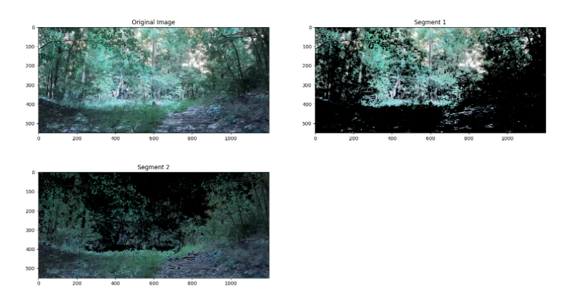

# KMeans_HAC
This is a program that implements kmeans or HAC to create image segmentation clusters.

The K-means algorithm is implemented and tested. Run the K-means program to solve clustering of input image on default values. 

HAC is implemented but not tested.

### Instruction to run the Segmentor
1. Install dependant libraries
2. Run - 

python3 Segmenter.py '<path_to_image>' 

to run K Means segmentation with default values. 

Run python3 Segmenter.py -h for more details

### Results of an example run

