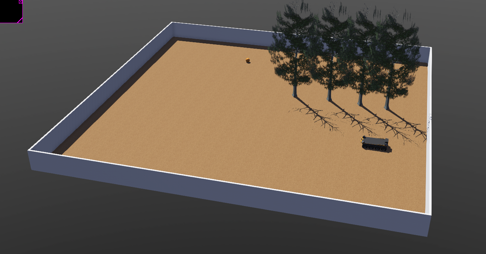
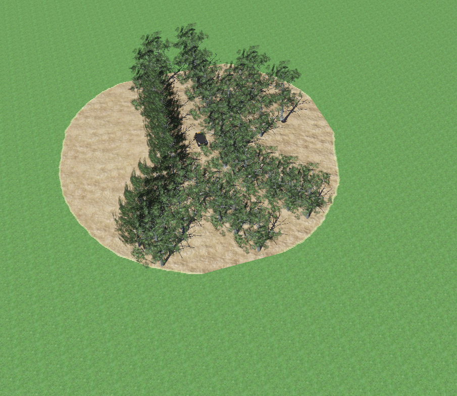
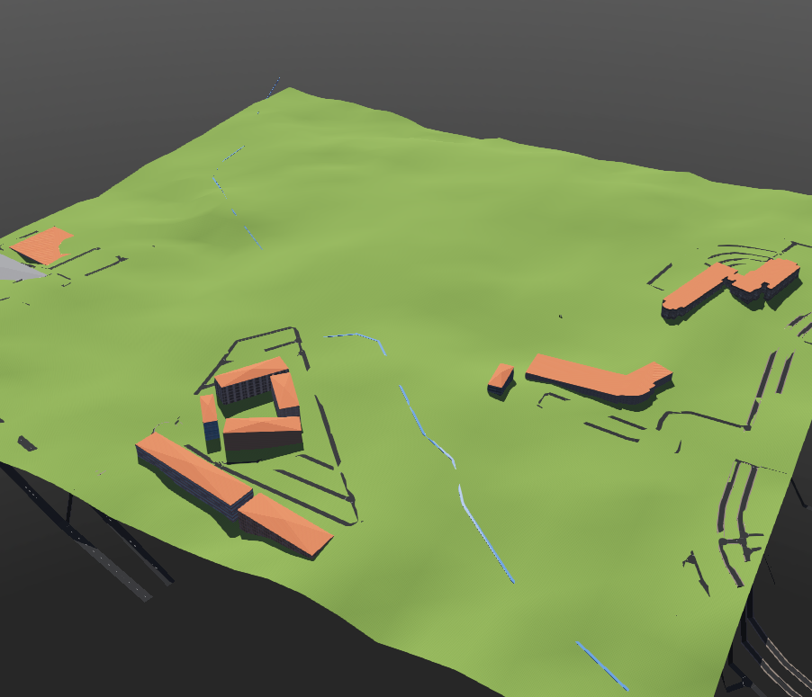

# Tree trails worlds
This is a repository of webots projects of varying compelxity. Level 10 beimg the simmplest and level 30 being the most complex. These worlds can be used to test out algorithms and models developed independantly

## Level 10 world
This is a world with the lowest complexity with the even ground and a few trees. Can be used to test out basic artificial potential field algorithms

A screenshot of level 10 world is shown below

## Level 20 world
This is a world with a slightly higher complexity. The world has uneven ground and lot more trees.

A screenshot of the level 20 world is shown below

## Level 30 world
This is a webots world of CAVS building and the proving ground created using OpenStreetMap tool. The rendering of the webots world is far from perfect due to the limitations of OpenStreetMap in generating map with elevation information. The world can be used as a reference to create a more robust rendering of the proving ground and the CAVS building.

A screenshot of the level 30 world is shown below

